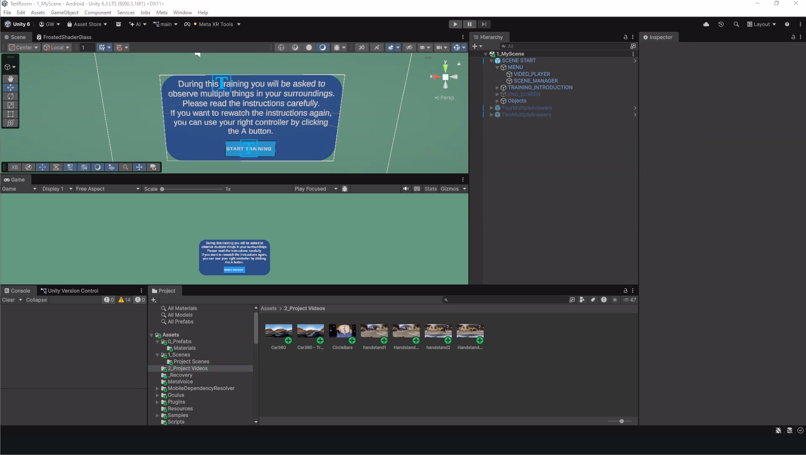

# Create a Scene {#create-a-scene}

This chapter explains how to create and configure a scene using the **[Project Template Name]** Unity project template.

Since this may be your first time using Unity, each step includes a **navigation path** showing exactly where to navigate in Unity's interface.

---

## Step 1: Import the Videos into Unity {-}

Begin by importing the videos that you plan to use in the training.

1. Locate the **Project** panel and open the following path: 

<div align="center">
`Assets > 1_Scenes > Project_Scenes`
</div>

2. Drag the video files from your computer into the `2_Project_Videos` folder.
3. Wait for Unity to finish importing each video.
4. Rename each video.

> **TIP:** Give each **video** a short, descriptive filename that reflects its position in the training sequence.

```text
For example:

01_video_lunges_step_1.mp4
02_video_lunges_step_2.mp4
03_video_push_ups_step_1mp4
```

```{r import-project-image, echo=FALSE, out.width="100%", fig.align="center", fig.cap="Importing the project into Unity Hub."}

```

---

## Step 2: Create a New Scene {-}

Create a new scene for each video in the training.

> **Important:** In this project template, each scene corresponds to one video — so the number of scenes must match the number of videos you imported. For example, a training with three videos will normally require three separate scenes.

1. Locate the **Project** panel and open the following path:

<div align="center">
`Assets > 1_Scenes > Project_Scenes`
</div>

2. You should see the following pre-built scenes on the right side of the window: `0_STARTING SCENE`, `1_FIRST_SCENE`, and `LAST SCENE`.
3. To create your first scene you will use the `1_FIRST_SCENE` as a template. Right-click in it and rename to your convenience. 

> **TIP:** Just like you did when you imported the videos, it is good practice to use a sequence number and a descriptive title to keep the scenes organized.

```text
For example:

01_scene_introduction
02_scene_demonstration
03_scene_practice
```
4. To write the instructions of the training (e.g., In this training you will be asked to complete ...) locate the **Hierarchy** panel and open the path: 
 
<div align="center">
`SCENE START > TRAINING_INTRODUCTION`
</div>

5. Write the instructions in the text box and save the file (i.e., Ctrl + S).

---

## Step 3: Add a Video to the Scene {-}

Once you have renamed the scene, assign its corresponding video.

1. Locate the scene you want to add the video to, and double-click it to open it.

> **Important:** Double-clicking is required to open a scene — a single click is not enough. To confirm a scene is open, check that its name matches the name shown at the top of the **Hierarchy** panel.

2. In the **Hierarchy** panel, open the following path:

<div align="center">

`SceneStart > MENU > VIDEO_PLAYER`

</div>

3. Select **VIDEO_PLAYER**.
4. In the **Inspector** panel, follow the path:

<div align="center">

`VIDEO_PLAYER > Video Clip`

</div>

5. Drag the video you want to use from the video folder into the **Video Clip** field.

> **Tip:** You can find these in the **Project** panel:
>
> - **Scenes:** `Assets > 1_Scenes > Project_Scenes > [YOUR SCENE NAME]`
> - **Videos:** `Assets > 1_Scenes > [VIDEO FOLDER NAME]`

6. Confirm that the video appears by double-clicking on it
7. Save the scene with `Ctrl + S`.

---

## Step 4: Set Up the Questions {-}

In this section, you will set up the following for the scene you just created:

- The instructions for each question
- The content of each question
- The content of the multiple-choice answers
- Which answer is correct
- The correct feedback (shown when the participant answers correctly)
- The corrective feedback (shown when the participant answers incorrectly)

1. Locate the **Project** panel and open the path:

<div align="center"> 
`Assets > Prefabs` 
</div>

2. Depending on the number of answer choices you want, drag **FourMultipleAnswers** or **TwoMultipleAnswers** into the **Hierarchy** panel, into the gray area. You can add as many questions as you want per video.

   For example, for a three-minute video with four questions — three with two answer choices and one with four answer choices — you would drag **TwoMultipleAnswers** three times and **FourMultipleAnswers** once into the **Hierarchy** panel.

> **Note:** Make sure the prefab appears directly under `SCENE START`, and not nested inside one of its folders (see image below). If it appears in the wrong place, delete it (left-click it, then press Delete) and drag it again.

3. Click the question prefab to select it, then locate the **Inspector** panel and its **EDIT EVERYTHING BELOW THIS** subsection:

    - **3.1.**To edit the instruction text — replace `Write the content of the instructions here`.
    - **3.2.**To edit the question text — replace `Write the content of the question here`.
    - **3.3.**To edit the answer choices text — write each answer directly into its corresponding **Answer Choice** box (**Answer Choice 1**, **Answer Choice 2**, etc.).
    - **3.4.**To edit the correct feedback text — replace `Write your correct feedback here`.
    - **3.5.**To edit the corrective feedback text — replace `Write your corrective feedback here`.

4. To choose which answer will be considered as correct, write the number of the answer in the `Conrrect Answer Choice`.
5. Repeat steps 3 and 4 for each question you have. 

> **Note:** You have the option of providing more detailes corrective feedback if the participant answers wrong multiple times the same question. You can write more detailed feedback on the subsections `Corrective Feedback Text  2`, `Corrective Feedback Tex 3` and `Corrective Feedback Tex 4`. 


Use the **Scene Manager** to determine when questions will appear during the video.

### Open the Dynamic Sequence Setup

1. In the **Hierarchy** panel, select ***SCENCE MANAGER*** in the the following path:

   `SCENE START > MENU > SCENE MANAGER`

2. Go to the **Inspector** panel, locate **Dynamic Sequence Setup**.

You will see two main lists:

| List | Purpose |
|---|---|
| **Question Canvases** | Determines which question appears at each pause. In other words, the order of questions |
| **Pause At** | Determines when the video pauses for each question om seconds|

#### Configure Question Canvases

3. Drag the questions objects that you have from the ***Hierarchy*** panel to the Question Canvases
4. Write the time in the video where the questions should appear. Take into account that the numbers are in second, and they should correspond to the seconds in the Video. 


#### Configure the Pause Times

1. Set the number of items equal to the number of questions in the scene.
2. Enter the video time at which each question should appear.
3. Arrange the timestamps in chronological order.

For example:

| Item | Pause time |
|---:|---:|
| 0 | 60 seconds |
| 1 | 120 seconds |
| 2 | 180 seconds |

In this example, the questions will appear at 1:00, 2:00, and 3:00 minutes.

### Verify that the scenes are connected

1. Open the scenes in the ***Project*** panel `ASSETS > 1_SCENES > PROJECT SCENES`
2. Leave the scenes open 
3. In the ***Hierarchy*** panel, in the subsection **Scence Settings**write the name of the scene that will appear after the video ends. If it is the end of the tutorial, write `LAST SCENE`, so that it connects to the last scene of the project. 


---

## Step 5: Verify the Question Order {-}

Before continuing, confirm that:

- Every pause time has a corresponding question canvas.
- The pause times are arranged chronologically.
- The question canvases are arranged in the intended order.
- The number of items in both lists is identical.
- Each question is associated with the correct point in the video.

> **Warning:** Questions may appear at the wrong times when the order of the question canvases does not match the order of the pause times.

---

## Step 6: Edit the Beginning Screen {-}

The beginning screen introduces the training before the video starts.

1. Locate **BeginSceneCanvas** in the **Hierarchy** panel.
2. Expand the canvas to locate its text elements.
3. Select the header text.
4. In the **Inspector** panel, replace the existing text with the introduction for your training.
5. Save the scene.

For example:

> Welcome to the caregiver training. In this module, you will observe a caregiver responding to a child during a daily routine.

Keep the introduction:

- Brief
- Easy to read
- Relevant to the video
- Consistent with the purpose of the training module

---

## Step 7: Edit the End Screen {-}

The end screen determines which scene will open after the current scene is completed.

1. Locate **End Screen** inside the **SceneStart** prefab.
2. Select the field that identifies the next scene.
3. Enter the exact name of the scene that should open next.

For example:

```text
02 Demonstration
```

> **Important:** The scene name must be written exactly as it appears in the Unity scene list. Differences in capitalization, spacing, or punctuation may prevent Unity from opening the scene.

### Configure the Final Scene

When the current scene is the final scene in the training, enter:

```text
Last Scene
```

Make sure that `Last Scene` matches the text expected by the project template exactly.

---

## Step 8: Add the Scene to the Build Profile

Every new scene must be added to the Unity build profile.

1. Open the scene that you want to add.
2. Select **File** from the Unity menu.
3. Select **Build Profiles**.
4. Click **Open Scene List**.
5. Click **Add Open Scenes**.
6. Confirm that the scene appears in the scene list.

Repeat this process whenever you create a new scene.

> **Important:** A scene that is not included in the build profile may work inside the Unity Editor but fail to open in the completed application.

---

## Step 9: Save the Scene

Save the scene after making any changes by pressing:

```text
Ctrl + S
```

You should save the scene after:

- Assigning a video
- Changing question timestamps
- Adding question canvases
- Editing the beginning screen
- Editing the end screen
- Adding the scene to the build profile

---

## Scene Configuration Checklist

Before moving to the next scene, confirm that:

- [ ] The scene has a clear and unique name.
- [ ] The correct video has been assigned.
- [ ] The video plays correctly.
- [ ] The number of pause times matches the number of questions.
- [ ] Each question canvas is in the correct position.
- [ ] The beginning-screen text has been updated.
- [ ] The next-scene name has been entered correctly.
- [ ] The scene has been added to the build profile.
- [ ] The scene has been saved.

After completing this checklist, repeat the process for the next video in the training.